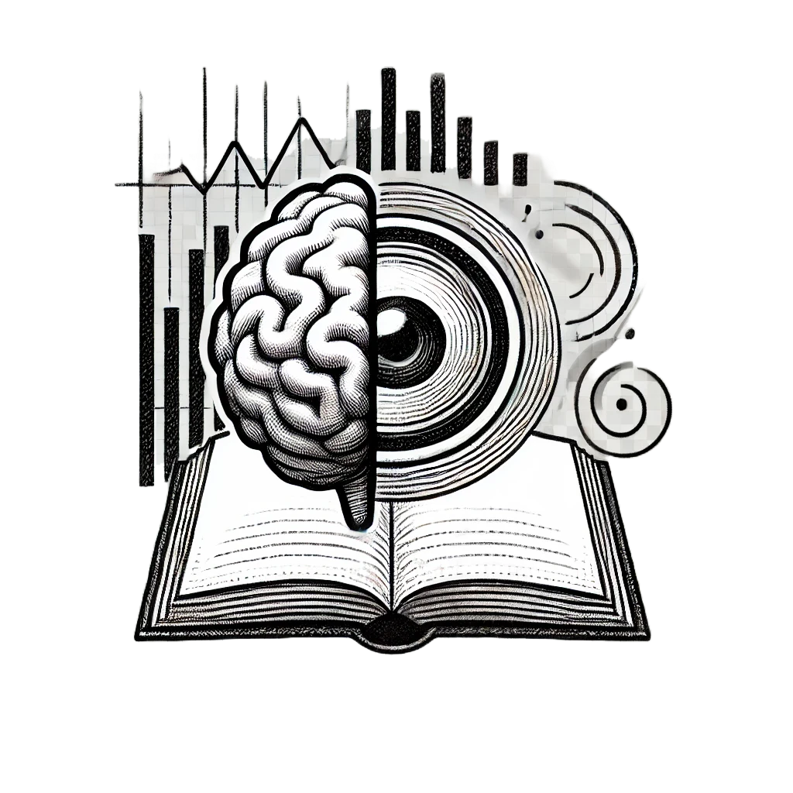

# AnyModal: A Flexible Multimodal Language Model Framework for PyTorch



**AnyModal** is a modular and extensible framework for integrating diverse input modalities (e.g., images, audio) into large language models (LLMs). It enables seamless tokenization, encoding, and language generation using pre-trained models for various modalities.

## Key Features

- **Flexible Integration**: Easily plug in different input modalities like vision, audio, and structured data.
- **Tokenization Support**: Tokenizes inputs from non-text modalities and combines them with LLMs for generation.
- **Extensible Design**: Add new input processors and tokenizers with minimal code changes.

## How to Use AnyModal

The best way to get started with AnyModal is to have a read-through of the steps below and then see the examples provided in the `demos` directory. Also, check out the `anymodal.py` file to understand the core components of the framework.

### 1. Installation and Setup

To use AnyModal in your project, follow these steps:

1. **Copy `anymodal.py`**:  
   Copy the `anymodal.py` file into your project directory.

2. **Install Dependencies**:  
   Ensure the following dependencies are installed:
   ```bash
   pip install torch transformers datasets torchvision tqdm
   ```
   You may also need to install additional dependencies based on your use case.

### 2. Implementing Input Modality Tokenization

AnyModal requires three core components for input processing:

1. **Input Processor**: Processes raw input data into a format compatible with the encoder.
2. **Input Encoder**: Encodes the processed data into feature representations.
3. **Input Tokenizer**: Projects the encoded features into a token embedding space.

Example of integrating an image modality using Vision Transformer:

```python
from transformers import ViTImageProcessor, ViTForImageClassification
from anymodal import MultiModalModel
from vision import VisionEncoder, Projector

# Load vision processor and model
processor = ViTImageProcessor.from_pretrained('google/vit-base-patch16-224')
vision_model = ViTForImageClassification.from_pretrained('google/vit-base-patch16-224')
hidden_size = vision_model.config.hidden_size

# Initialize vision encoder and projector
vision_encoder = VisionEncoder(vision_model)
vision_tokenizer = Projector(in_features=hidden_size, out_features=768)

# Load LLM components
from transformers import AutoTokenizer, AutoModelForCausalLM
llm_tokenizer = AutoTokenizer.from_pretrained("meta-llama/Llama-3.2-1B")
llm_model = AutoModelForCausalLM.from_pretrained("meta-llama/Llama-3.2-1B")

# Initialize AnyModal
multimodal_model = MultiModalModel(
    input_processor=None,
    input_encoder=vision_encoder,
    input_tokenizer=vision_tokenizer,
    language_tokenizer=llm_tokenizer,
    language_model=llm_model,
    input_start_token='<|imstart|>',
    input_end_token='<|imend|>',
    prompt_text="The interpretation of the given image is: "
)
```

### 3. Training and Inference

Use AnyModal to train and generate predictions:

```python
# Training
for epoch in range(num_epochs):
    for batch in train_loader:
        optimizer.zero_grad()
        logits, loss = multimodal_model(batch)
        loss.backward()
        optimizer.step()

# Inference
sample_input = val_dataset[0]['input']
generated_text = multimodal_model.generate(sample_input, max_new_tokens=30)
print(generated_text)
```

### 4. Extending AnyModal

You can extend AnyModal by implementing new input processors and tokenizers. For example:

```python
class AudioProcessor:
    def __init__(self, sample_rate):
        self.sample_rate = sample_rate

    def process(self, audio_data):
        # Your audio preprocessing logic
        pass
```
Furthermore, you can change the core components of AnyModal to suit your needs. Consider implementing/modifying functionalities like saving and loading models or pushing the saved projectors and LoRAs to the HF hub.

## Model Zoo

The AnyModal Model Zoo showcases pre-trained multi-modal models for various tasks, accessible on our [Hugging Face organization page](https://huggingface.co/AnyModal). Below is a list of currently available models:

### 1. VLM (Cartoon Captioning)

- **Model Description**: A projector network for vision-language multimodal models (consisting of a ViT and a Llama 3.2-1B model) trained for image captioning on cartoon datasets.
- **Pre-trained Weights**: Available [here](https://huggingface.co/AnyModal/VLM_Cartoon_Caption).
- **Project Directory**: Trained using the [Image Captioning demo project](https://github.com/ritabratamaiti/AnyModal/tree/main/Image%20Captioning).
- **Training Script**: [train.py](https://github.com/ritabratamaiti/AnyModal/blob/main/Image%20Captioning/train.py).
- **Inference Script**: To use the model for inference, refer to [inference.py](https://github.com/ritabratamaiti/AnyModal/blob/main/Image%20Captioning/inference.py).

Stay tuned as we add more models to the zoo, covering diverse use cases.

## TODO List

- [x] **AnyModal demo for LaTeX OCR**  
- [x] **AnyModal demo for Radiology Captioning**  
- [x] **AnyModal demo for Image Captioning**  
- [ ] **AnyModal demo for Visual Question Answering**  
- [ ] **AnyModal demo for Audio Captioning / audio + textual instructions**  

Note that the demos are still in progress, and there is still room for improvement.
Do you have any other ideas for AnyModal demos? Feel free to suggest them!

## Contributions

Contributions are highly welcome! Whether it's fixing bugs, improving documentation, or adding support for new input modalities, your help is appreciated. Here's how you can contribute:

1. **Fork the repository** and clone it to your local machine.
2. **Create a new branch** for your feature or bug fix.
3. **Submit a pull request** describing your changes.

Let's build and improve AnyModal together!

## Community

Join our subreddit at [r/AnyModal](https://www.reddit.com/r/AnyModal) to discuss ideas, ask questions, and share your projects using AnyModal. You can also visit our [Hugging Face organization page](https://huggingface.co/AnyModal) for more resources, models, and examples.

## License

This project is licensed under the MIT License. Feel free to use and modify as needed.

---

Happy building with AnyModal! 🚀